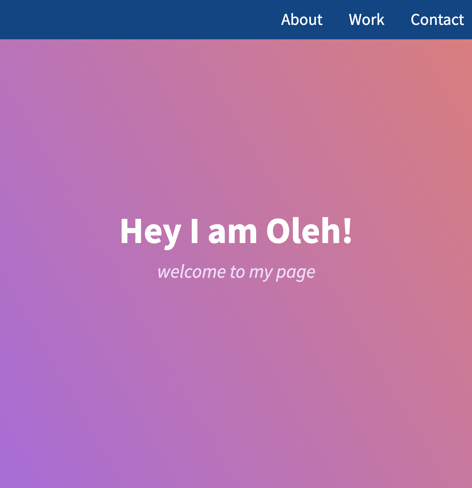
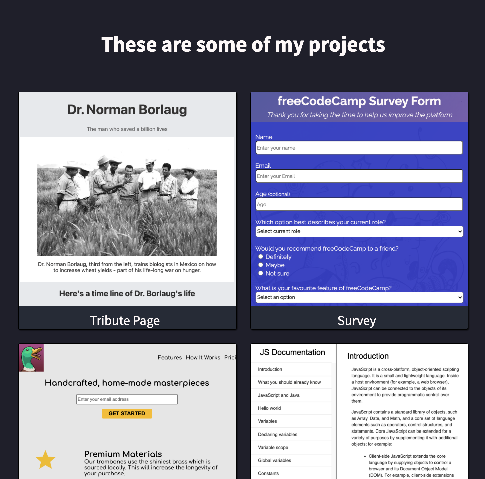

# Personal Portfolio

In this project I mimicked the FCC personal portfolio.

___

## Overview

Sample | Result
:-----:|:------:
|
|
|

___

## Goals

- [x] mimic [personal portfolio](https://codepen.io/freeCodeCamp/full/zNBOYG) following freeCodeCamp [user stories](https://www.freecodecamp.org/learn/responsive-web-design/responsive-web-design-projects/build-a-personal-portfolio-webpage)

___

## Lessons Learned

- creating an auto-fit/auto-fill grid
- linking files in local folders
- fitting objects inside containers
- using of vh/vw
- animating with keyframes rule
- [font awesome](https://fontawesome.com/) provides HQ icons
