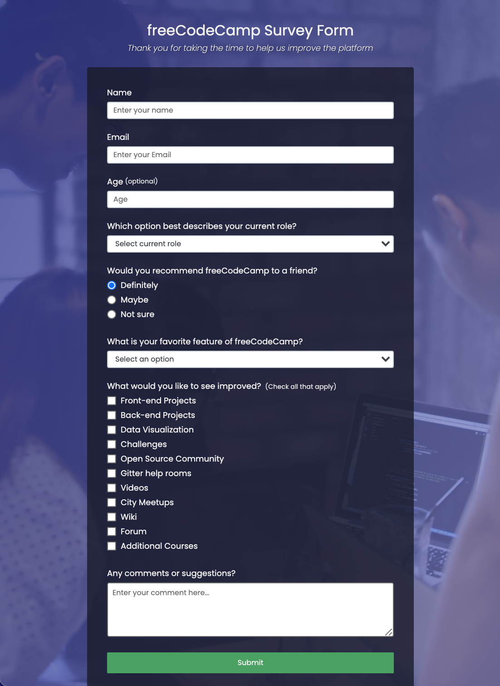
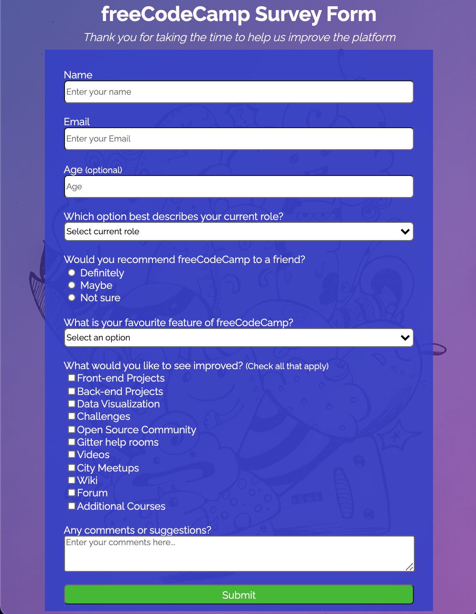

# Survey Form

In this project, I developed a survey form using HTML forms and CSS.
___

## Outcome

Sample | Result
:-----:|:------:
|

___

## Goals

- [x] replicate the functionality of a [survey form](https://codepen.io/freeCodeCamp/full/VPaoNP) following freeCodeCamp [user stories](https://www.freecodecamp.org/learn/responsive-web-design/responsive-web-design-projects/build-a-survey-form)
- [x] add external fonts to HTML
- [x] add external backgroung image
- [x] revise HTML forms
- [x] practice CSS Box Model elements styling

___

### Changelog

>**12/25/20** - added background image\
>**12/24/20** - reformatted HTML, added CSS styling\
>**12/23/20** - attempted to apply CSS, understood that HTML structure _must_ be reformatted\
>**12/22/20** - added plain HTML structure\
>**12/21/20** - created basic files, added plain text to index.html
