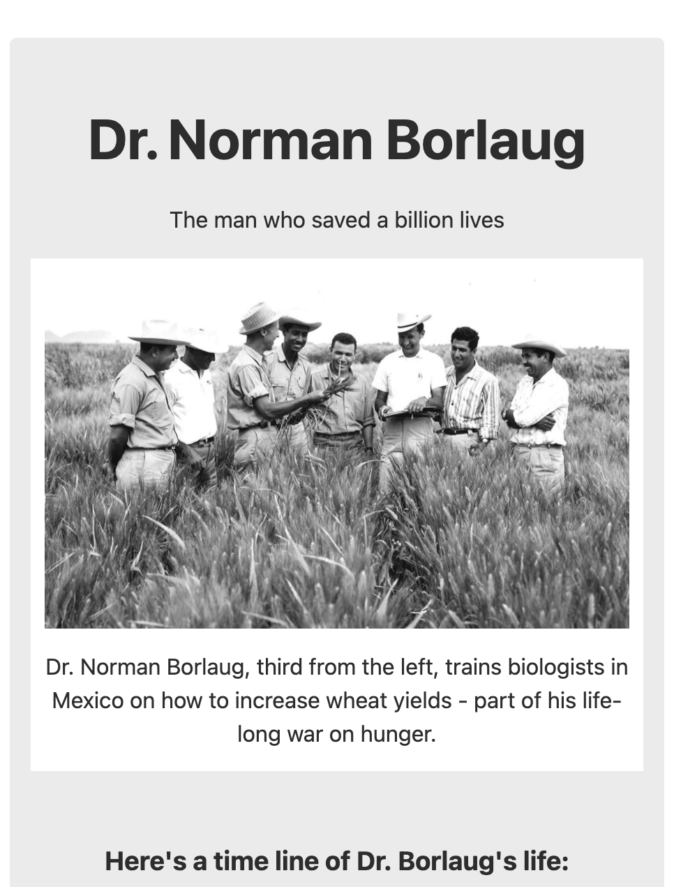
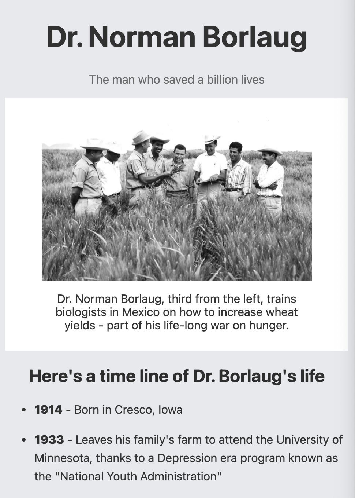

# Tribute Page

It was the first project that covered the basics of HTML and CSS.
___

## Result

Sample | Result
:-----:|:------:
|

___

### Goals

- [x] replicate a [static page](https://codepen.io/freeCodeCamp/full/zNqgVx, "sample page") following freeCodeCamp [user stories](https://www.freecodecamp.org/learn/responsive-web-design/responsive-web-design-projects/build-a-tribute-page "FCC user stories")
- [x] develop a solid understanding of HTML/CSS basics
- [x] revise Box Model parameters and attributes

### Changelog

>**12/21/20** - added required CSS styling and finished the assignment\
>**12/20/20** - created the basic structure of the page, its plain text
